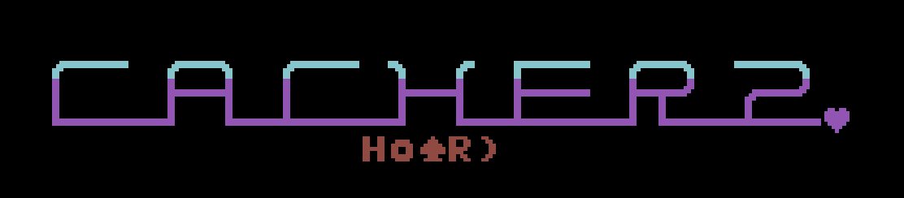
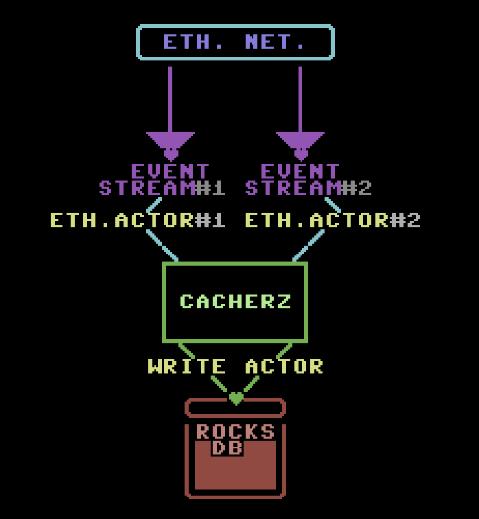

# This is CACHERZ.

Cacherz is a service built to get events from ethereum network. The service identifies events definitions in your contract.

There is an actor created per each event. The event is registered as a filter by json-rpc. Each event filter is a different data pipeline. After event filter registration Cacherz asks for more events. It starts from the last block number and log number attributed to events already in the database. When ethereum actor gets the answer from Ethereum network it decodes it and sends it into write actor which is responsible for writing data into database. 

## Features:

* Async and mutithreaded by default
* Works with all modern versions of Solidity
* Works with all ethereum networks.
* Json on output side
* Compress data by default
* Support prefixes

## Requirements and setup.

### Requirements
* Rust >= 1.32
* RocksDB >= 5.14

### Setup
* Go to: `https://rustup.rs/` and install Rust. Just like that...
* Install RocksDB:
  * Ubuntu: `sudo apt-get install librocksdb-dev`. 
  * Mac: 
    * run `brew tap homebrew/versions`
    * run `brew install gcc48 --use-llvm` to install gcc 4.8 (or higher).
    * run `brew install rocksdb`
  * Windows: you can find instructions here: https://github.com/facebook/rocksdb/blob/master/INSTALL.md
* In a project folder type `cargo build`

### Hey! Pss...yeah you! ...Would you like to run some cache? 

* to run cache...you have to go to `target` folder. Then `debug` folder and thats it. 
* now follow me Alice into that hole in the ground
    * To run cache you have to setup a bunch of flags. 

    First of all two enviroment: 
  * `RUST_BACKTRACE=1` and `RUST_LOG=1`...why? There is a big probability that something will fail...and we have to know why;)
  Then we can type: `./cacherz` with flags:
  * `--webHost` it is a host of your cache maschine (for localhost it is just "localhost")
  * `--webPort` the same as above ...but for port.
  *   `--ethHost` host of your Eth node
  *    `--ethPort` prot of your Eth node
  *  `--abiFilePath` path to your abi file 
  *  `--rocksdbPath` path to your rocksdb folder (folder where rocksdb will be putting its data).

Example: 

`./cacherz --webHost "localhost" --webPort "8080" --ethHost "localhost" --ethPort 8545 --abiFilePath "/Users/cacherz_user/Documents/contracts/HoardExchange.json" --rocksdbPath /Users/cacherz_user/Documents/rocksdb`

## Usage

You can ask about your cached events in a couple of ways

  * Asking about event:
    * `http://localhost:8080/get_events/` with params:
      * `column_family` - column family is just a column name. In Cacherz there a couple of column families: 
        * "events" - column responsible for store all events data.
        * "aggregations" - column for store aggregeted data.
        *  "stats" - column fot store stats data.
        *   "settings" - column for store settins data.
        *   "filters" - column for store filters state data.
        *    "log" - column for store logs.
      * method - param can have two possible variants. "prefix" or "key".
      * key - key name.
      * block - block number from which we would like to query
      * log - log number from which we would like to query. 
  Ex.

  `http://localhost:8080/get_events/?column_family=events&method=prefix&key=Transfer&block=0x0&log=0x0&size=100`
## What next? Is it the end of cacherz road? Hell no! We are only at the begginig. 

- [x] Read events from json file
- [x] Register on multiple events (event per Eth actor)
- [x] Read multiple events
- [x] Store events in RockDB by Write Actor
- [x] Web access into events
- [x] Events pagination
- [x] Search events by prefix
- [x] Serach events by key
- [ ] Possibility of using multiple contracts (10%)
- [ ] Lua actors (50%)

## Licence
  MIT BSD